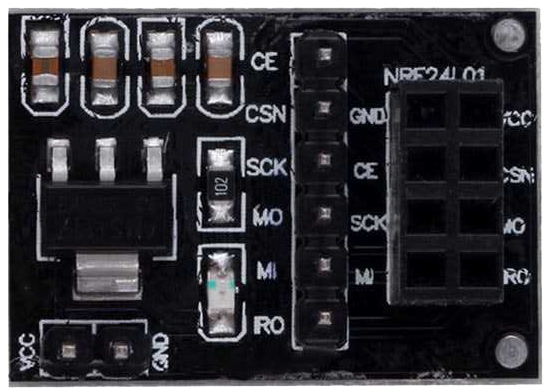
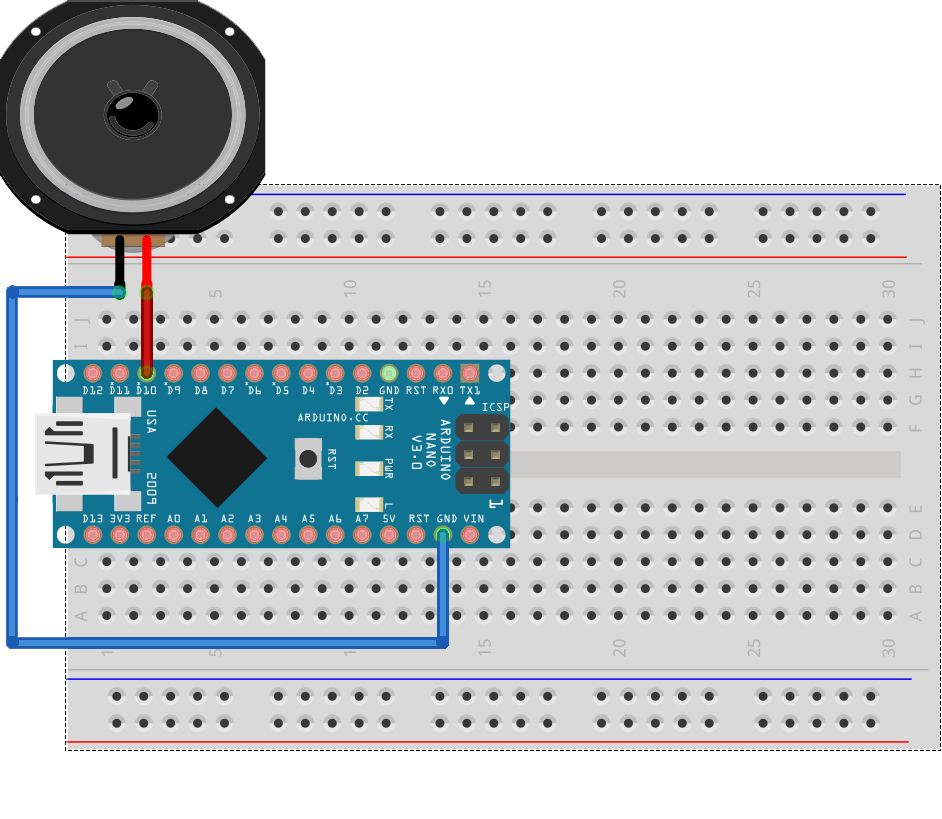
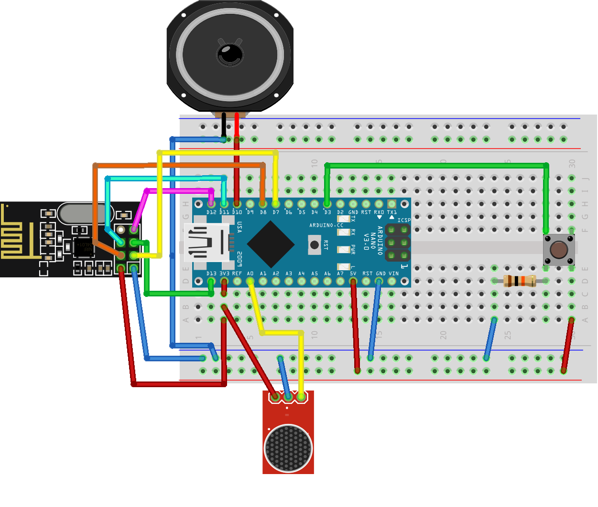
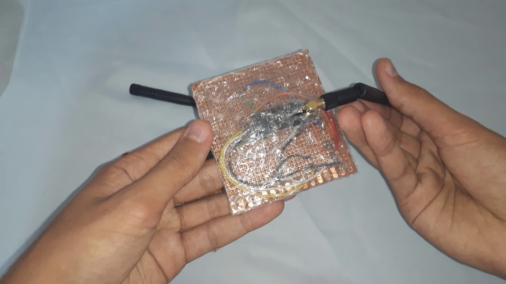
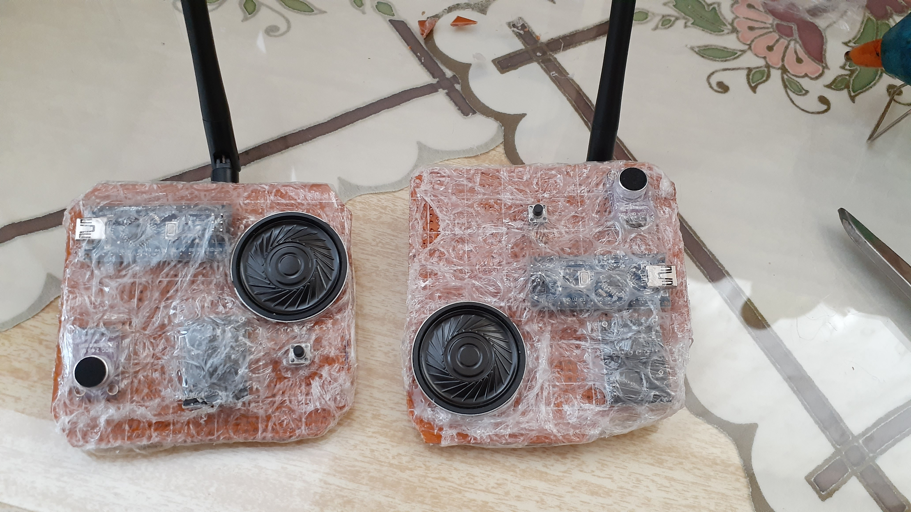


Bu proje walkie-talkie yani bas-konuş özellikli telsiz yapımını, gerekli malzemeleri, kodları ve benim nasıl yaptığımı, yapamadığımı içerir.


> Projenin videolu anlatımı ve testlerini aşağıdaki videodan izleyebilirsiniz.\
> [❤️ Arduino ile Walkie-Talkie(Telsiz) Yapımı ve Testleri](https://www.youtube.com/channel/UCcg8zjG1kt-6sRfb4ajHWXQ) (Video Henüz Yayınlanmadı)





## 🛠️Kullanılan Malzemeler

- 2 adet **[Arduino Nano](https://www.direnc.net/arduino-nano-usb-chip-ch340-usb-kablo-dahil)**
    - Boyutundan ötürü *`Nano`* tercih ettim. Uno, Mega veya Nano kullanmak size kalmış.
    - Mega kullanıcaksanız bağlantılarda birkaç değişiklik oluyor unutmayın! (Anlatımda bundan bahsedicem)
    
- 2 adet **[nRF24L01 PA LNA 2.4GHz Alıcı - Verici Modül](https://www.f1depo.com/Nrf24l01-Pa-Lna-24-ghz,PR-978.html)**
    - Antenli versiyonunu kullandım.
    - İki versiyonun da bağlantıları aynı.
    - Antensiz versiyonu açık alanda ort. 100m, kapalı alanda ise ort. 10-20m mesafede çalışıyormuş(Söylenene göre...)
    - Antenli versiyonu ise ort. 10 kat arttırıyor. (Mesafe testinin videosu [*🙏Yardım Aldığım Kaynaklar*](#yardım-aldığım-kaynaklar "🙏Yardım Aldığım Kaynaklar")'da mevcut)
    - VCC yi 3.3V'a bağlayın yoksa bozuluyor veya adaptör ile 5V da kullanın. Ben adaptörle 5V da kullandım.
    - Adaptörsüz kullanıcaksanız modüle kondansatör lehimlemeniz gerekiyor. [*🙏Yardım Aldığım Kaynaklar*](#yardım-aldığım-kaynaklar "🙏Yardım Aldığım Kaynaklar")'da hangi pinlere bağlandığıyla ilgili link var. 
    
- 2 adet **[nRF24L01 Wireless Modül Adaptörü](https://www.direnc.net/8-pin-nrf24l01-wireless-modul-adaptoru)**
    - Bu adaptör 5V ile çalışmayı sağlıyor.
    - Antenli yada antensiz olsun ikisinde de kullanmanızı öneririm.
    - Paraziti de azaltıyormuş(!)
    
- 2 adet **[MAX4466 Elektret Mikrofon](https://www.f1depo.com/urun/gy-max4466-elektret-mikrofon-amplifikatoru-max4466)**
    - 5V veya 3.3V'da kullanabilirsiniz ama 3.3V'da daha temiz ses elde ettim.
    
- 2 adet **[8R 0.5W 83DB 36x5mm Hoparlör](https://www.direnc.net/8r-05w-83db-36x5mm-hoparlor)**
    - Ses seviyesi olarak yeterliydi.
    - Arduino'nun besleyebileceği boyutta her hoparlörün de çalışacağını düşünüyorum.

- 2 adet **[Buton](https://www.direnc.net/6x6-8-5mm-tach-buton-4-bacak)**
    - Benim kullandığım butonun tuş kısmı biraz uzun ve çapı küçük.
    - Daha geniş boyutlarda buton daha rahat kullanımı olabilir.
    - 2 bacaklı herhangi buton da çalışacakdır.
    
- 2 adet **[10K Direnç](https://www.direnc.net/10k-14w-direnc)** (*Kahve-Siyah-Turuncu-Altın*)

- **Jumper Kablo** (*[Dişi-Erkek](https://www.direnc.net/40-adet-disi-erkek-jumper-20cm), [Erkek-Erkek](https://www.f1depo.com/40-pin-Erkek-Erkek-200mm-20cm-Jumper-Kablo,PR-695.html)*)

- 2 adet **Breadboard**
    - Devreyi kurup test etmek için kullandım.
    - Çeşit olsun diye farklı boyutlarda aldım. Orta boy, devre için yeterli alanı sağlıyor.
    - [Büyük Boy Breadboard](https://www.direnc.net/tekli-breadboard)
    - [Orta Boy Breadboard](https://www.direnc.net/breadboard-mini-yapiskanli)
    
- **[Pertinaks](https://www.f1depo.com/Delikli-Plaket-12x18-cm-Pertinaks,PR-2256.html)**
    - Breadboard üzerindeki testlerden sonra devreyi lehim ile sabit halde kullanmak için aldım.
    - Jumper kablolar ortada cirit atmamış oluyor.
    - İlk pertinaks alma ve kullanma deneyimim olacağından dolayı riske atmayıp 2 adet almıştım ama 1 tanesi(12x18cm) yetti.
    
- **[Havya](https://www.f1depo.com/urun/40w-kalem-havya-tse-onaylidir)**
    - Eğer pertinaks üzerine lehimleme yapmayacaksanız sadece hoparlör kablolarını lehimlemek için kullandım.
    - Daha ince havya ucu ile lehim daha kolay yapılabilirdi.
    
- **[Lehim Teli](https://www.f1depo.com/urun/pinax-tup-lehim-teli-1-2mm)**
    - 1.2mm kalınlığında tel kullandım ama daha ince (0.75mm vb.) tel ile lehim işlemi daha kolay olabilir.
    - Yakın pinleri lehimlerken bir yandan lehim teli bir yandan kablo bir yandan havya ucu biraz zorladı.
    
- **Silikon Tabancası**
    - Devrede hareketli parçaları sabitlemek ve devreye çıplak elle teması engellemek için dışını balonlu naylonla(patlatılan poşetler) kaplamak için kullandım.
    - Hoparlör sarkık durmaması için de kullandım.
    
- **Kablo Soymak için Aletler**
    - Kablo soyma pensesi yerine yan keski ve pense kullandım ama soyma pensesi olsa çok daha kolay olurdu.

---

## 📥Kütüphanelerin ve Kodların İndirilmesi

***RF24***, ***RF24Audio*** kütüphanelerini ve telsiz için gereken kodları aşağıdaki bağlantılardan indirin.

**RF24:** [github.com/nRF24/RF24](https://github.com/nRF24/RF24)\
**RF24Audio:** [github.com/nRF24/RF24Audio](https://github.com/nRF24/RF24Audio)\
**Gerekli Kodlar:** [github.com/ZekeriyaAY/Arduino-Walkie-Talkie](https://github.com/ZekeriyaAY/Arduino-Walkie-Talkie)


## 📤Kütüphanelerin IDE'ye Eklenmesi

İndirilen `.zip` dosyalarını aşağıdaki yol ile ekleyin.

> ⚠️ *Sadece **RF24** ve **RF24Audio** dosyaları kütüphane dosyalarıdır.*

```arduino
    Arduino IDE > Taslak > library ekle > .ZIP Kitaplığı Ekle...
```


## 📤Kodların Arduino'ya Yüklenmesi
Bu aşamaya şuan ihtiyaç yok ancak devre bağlantılarını yaptıktan sonra kodları burada anlatıldığı gibi yüklemeniz için eklendi.

1. İndirilen `Arduino-Walkie-Talkie-main.zip`  dosyasının içindeki yüklemek istediğiniz `.ino` uzantılı Arduino kodunu IDE ile açın.
2. Arduino'yu bilgisayara takın.

```arduino
    Araçlar > Kart //Kullandığınız Arduino türünü seçin
    Araçlar > Port //Kartın takılı olduğu portu seçin
```

> Portlarda kartınız gözükmüyorsa -> [CH340 çipli klon arduino sürücüleri nasıl yüklenir?](https://maker.robotistan.com/arduino-uno-suruculeri-nasil-yuklenir-ch340-cipli-klon/)

&emsp;Doğru kartı ve portu seçtiğinizden eminseniz iki Arduino'ya da kodları yükleyebilirsiniz.


> Yükleme sırasında sorun çıktı ise;
> ```arduino
>   Araçlar > Islemci  //Diğer seçeneklere bi' bak
>   ATmega328P(Old Bootloader) seçtiğimde sorun geçmişti.
> ```

---

## 🗺️Devre Kurulumu ve Test Edilmesi

Sıra aldığımız malzemeleri birleştirip test etmeye geldi.


### 📡nRF24L01 Bağlantısı ve Testi
nRF24L01 modülü ve kullanacağımız adaptörün pin dizilimini aşağıdaki resimlerden ulaşabilirsiniz.


 
Adaptör kullanmadan yapılan bağlantı aşağıda gösteriliyor. Adaptör kullanarak yapılan bağlantıda tek değişiklik `VCC`'yi `3.3V` yerine `5V`'a bağlamanız.

* Boş olan pin, kullanılmayan `IRQ` pini.


> Aşağıdaki pin dizilimleri *Nano/Uno* içindir. *Mega* için farklı pinler kullanılıyor. [🙏**Yardım Aldığım Kaynaklar**](#yardım-aldığım-kaynaklar)'da o bağlantıları bulabilirsiniz.


| **nRF24L01** | **Arduino** |
|:------------:|:-----------:|
|      GND     |     GND     |
|      VCC     |   3.3 / 5V  |
|      CE      |      D7     |
|      CSN     |      D8     |
|      SCK     |     D13     |
|     MOSI     |     D11     |
|     MISO     |     D12     |


> `Arduino-Walkie-Talkie-main.zip` dosyasındaki `receiver.ino` kodunu bir Arduino'ya, `transmitter.ino` kodunu diğer Arduino'ya yükleyin.

İki kodu da farklı Arduinolara yükledikten sonra alıcı kodunu yüklediğiniz Arduino'nun "**Seri Port Ekranı**" nda "**Hello Ardu**" yazısını görüyorsanız bağlantılar doğrudur demektir.


### 🔊Hoparlör Bağlantısı ve Testi



Hoparlör üzerinde kırmızı kablo(+) ``D10`` pinine, siyah kablo(-) ``GND`` pinine bağladım.

`Arduino-Walkie-Talkie-main.zip` dosyasındaki `speaker.ino` kodunu Arduino'ya yükleyip hoparlör bağlantılarını melodi sesleriyle test edebilirsiniz.


### 🔘Buton Bağlantısı ve Testi


`Arduino-Walkie-Talkie-main.zip` dosyasındaki `button.ino` kodunu Arduino'ya yükleyin.

Kodu yükledikten sonra "**Seri Port Ekranı**" nda butona bastığınızda sayaç sayıları artıyorsa sıradaki ve son bağlantıya geçebilirsiniz.


### 🎤Mikrofon Bağlantısı ve Testi


> 5V'a da bağlayabilirsiniz. Ancak 3.3V da daha temiz ses elde ettiğim için 3.3V kullandım.

`Arduino-Walkie-Talkie-main.zip` dosyasındaki `microphone.ino` kodunu Arduino'ya yükleyin.

Kodu çalıştırdıktan sonra "**Seri Port Ekranı**" nda mikrofona konuştuğunuz zaman Volt değerlerinin değiştiğini göreceksiniz. Eğer değişim olmuyorsa bağlantıları kontrol edin.


### 🗺️Tüm Bağlantı Şeması



Resim 7'de devrenin son hali var. Şemaları çizdiğimiz programda nRF24L01 antenli versiyonu veya adaptörü olmadığı için şemada antensiz ve adaptörsüz halini görüyorsunuz. Bağlantılarda herhangi bir farklılık yok.
> Eğer adaptör kullanıcaksanız adaptörün `VCC`'yi `3.3V` yerine `5V`'a bağlayın.

---

## 📤Ana Kodun Arduino'ya Yüklenmesi

İndirilen `Arduino-Walkie-Talkie-main.zip`  dosyasının içindeki `main.ino` kodu iki Arduino'ya [📤Kodların Arduino'ya Yüklenmesi](#kodların-arduinoya-yüklenmesi "📤Kodların Arduino'ya Yüklenmesi")nde anlatıldığı gibi yükleyin.

Sorunsuz yüklendiyse butona basıp konuşmaya başlayabilirsiniz.

---

## 📦Lehim ile Sabit Devre Kurulumu


Devremizi breadboard üzerine kurduk, kodları yükleyip çalıştırdık. Sırada lehim ile pertinaks üzerine sabit devreyi kurma aşamasına geldik.


> Bu aşama zorunlu değildir. İsterseniz breadboard üzerinde kullanabilirsiniz ancak pertinaks üzerinde kablo karmaşası olmadan daha kullanışlı olduğu için bu aşamayı yaptım.
> Ayrıca pertinaks üzerinde sabit devrede mikrofonda gürültü daha da azaldı. Sanırım jumper kablolar daha az, daha kısa olduğu için parazit azaldı.



Alıcı-verici modülü sabitlemek için altına sıcak silikon sıktım. Yoksa hareket ettiğinde pinlerde temassızlık oluyor ve telsiz bağlantıları kesiliyordu.




Devrenin arkasındaki pinlere dokununca devre bozulabiliyor. Bu yüzden arkasına ve önüne patlatılan poşetlerden kesip sıcak silikonla yapıştırdım. Böylece devrelere temas etmemiş oluyoruz. 






---

## 🙏Yardım Aldığım Kaynaklar

- nRF24L01 modülü ile ilgili
    - Arduino Mega kullanıcaklar için bağlantılar bu linklerde bulunuyor.
    - [nRF24L01 çalışmasını çok güzel anlatıyor](https://lastminuteengineers.com/nrf24l01-arduino-wireless-communication/)
- [nRF24L01 Antenli ve Antensiz menzil testi videosu](https://www.youtube.com/watch?v=2tfa9i0bsX8&ab_channel=Merakl%C4%B1Maymun)
- [Walkie-Talkie yapan en detaylı kaynak olabilir ama eksikleri var(İngilizce)](https://www.instructables.com/id/Wristwatch-Walkie-Talkie/)
- [nRF24L01 adaptörsüz kullanıp kondansatör lehimlemeyi içeriyor](https://ugrdmr.wordpress.com/2018/07/22/arduino-telsiz-walkie-talkie/)

---

## 🖋️Sonuç Nasıl Oldu?

Sonuçtan büyük ölçekte memnunum. Birkaç tecrübe edindim.

- Pertinaks üzerine lehimlerken Arduino'yu direk lehimledim. Bunu yapmak yerine ***dişi-erkek pin header*** lehimleyip Arduino'yu bu headerlara takmak daha iyi olur. Böylece gerektiğinde Arduino'yu kolayca çıkartılıp yenisi takılabilir veya başka şeylerde kullanılabilir.
- İlk uzun lehim deneyimim olduğundan dolayımı bilmiyorum ama ***daha ince lehim teli***, ***daha ince havya ucu*** ve ***lehim pastası*** kullansam lehim işlemleri daha kolay olabilirdi.
- Kabloları soymak için ***kablo soyma pensesi***  kullanmak daha kısa sürmesine ve daha düzenli olmasını sağlar. Pense ve yan keski kullanarak biraz zor oldu.
- Telsiz çalışırken iki taraf da butona basılı tutup konuşmaya çalışınca iki taraf da duymadığı gibi bug'a girmesine neden oluyor. Böyle durumlarda Arduino üzerindeki reset butona basıp kodların tekrar çalıştırılmasını sağlayarak bug sorunu o anlık çözebiliyoruz. Bir taraf konuşurken diğer taraf da dinlemesini bilmeli yani 🙃


---
### Bu Repoya ⭐Yıldız, Youtube Videoma 💬Yorumunu Bırakıp, Eksiklerimi Söyleyerek Bana Destek Olabilirsin
> Telsizin testlerini ve yapım aşamasını aşağıdaki videodan izleyebilirsiniz.\
[❤️**Arduino ile Walkie-Talkie(Telsiz) Yapımı ve Testleri**](https://www.youtube.com/channel/UCcg8zjG1kt-6sRfb4ajHWXQ) (Video Henüz Yayınlanmadı)

> [***Yıldız Bırakmak için* Walkie Talkie GitHub Reposu**](https://github.com/ZekeriyaAY/Arduino-Walkie-Talkie)


